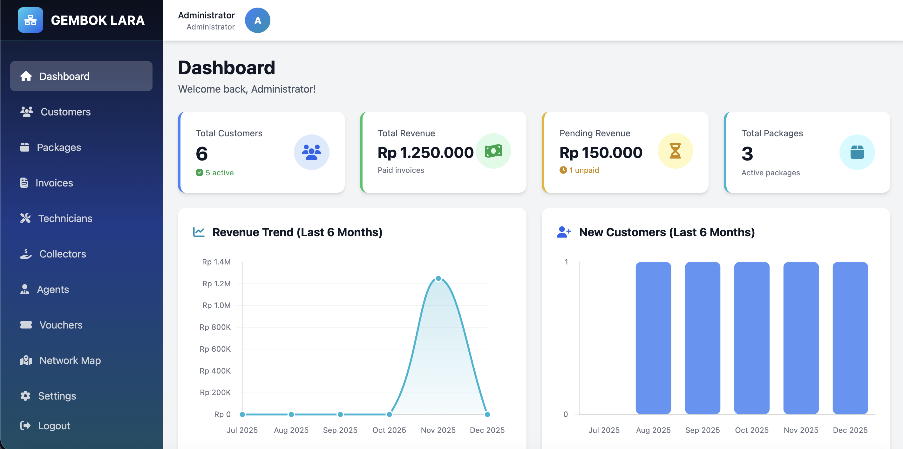
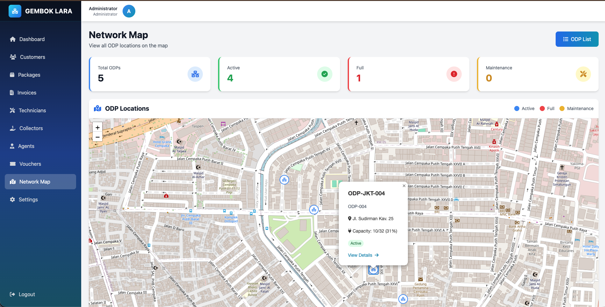

# 🔐 GEMBOK LARA - ISP Billing & Management System


**GEMBOK LARA** adalah sistem manajemen tagihan dan operasional ISP (Internet Service Provider) yang dibangun menggunakan **Laravel 12**. Sistem ini dirancang dengan antarmuka modern, analitik mendalam, dan fitur lengkap untuk mengelola bisnis ISP Anda.

---

## � Screenshots

<div align="center">
  
  
  
  
</div>

> **Note**: Screenshot aplikasi tersedia di folder `img/`

---

## ✨ Fitur Lengkap

### 🎨 **Modern UI/UX**
- **Theme ISP Network**: Desain modern dengan warna cyan & biru yang profesional
- **Responsive Design**: Tampilan optimal di desktop, tablet, dan mobile
- **Dark Sidebar**: Sidebar dengan gradient elegan dan navigasi intuitif
- **Interactive Charts**: Grafik analitik menggunakan Chart.js
- **Smooth Animations**: Transisi dan hover effects yang halus

### 📊 **Dashboard Analytics**
- **Real-time Statistics**: 
  - Total Customers & Active Status
  - Total Revenue & Pending Revenue
  - Package Distribution
  - Invoice Status
- **Interactive Charts**:
  - Revenue Trend (6 bulan terakhir)
  - Customer Growth Chart
  - Package Distribution (Doughnut Chart)
  - Invoice Status (Pie Chart)
- **Recent Activity**: Invoice dan customer terbaru
- **Quick Actions**: Akses cepat ke fitur utama

### 👥 **Customer Management**
- **CRUD Lengkap**: Create, Read, Update, Delete customer
- **Customer Profile**: Detail lengkap dengan statistik
- **Package Assignment**: Assign paket internet ke customer
- **Status Management**: Active, Inactive, Suspended
- **Search & Filter**: Pencarian dan filter berdasarkan status/paket
- **Invoice History**: Riwayat tagihan per customer

### 💰 **Invoice & Billing**
- **Auto Invoice Generation**: Generate invoice otomatis
- **Invoice Management**: Create, edit, view, print invoice
- **Payment Tracking**: Status paid/unpaid dengan tanggal bayar
- **Invoice Filtering**: Filter berdasarkan status, customer, tanggal
- **Professional Print**: Template invoice untuk print
- **Revenue Analytics**: Statistik pendapatan real-time

### 📦 **Package Management**
- **Flexible Packages**: Buat paket dengan harga dan kecepatan custom
- **Package Statistics**: Jumlah subscriber per paket
- **Tax Configuration**: Pengaturan pajak per paket
- **PPPoE Profile**: Mapping ke profil Mikrotik
- **Active/Inactive Status**: Kontrol paket yang ditampilkan

### 🎫 **Voucher System**
- **Voucher Purchase**: Sistem pembelian voucher online
- **Pricing Management**: Harga customer vs agen
- **Generation Settings**: Konfigurasi format voucher
- **Online Settings**: Durasi dan profil voucher
- **Delivery Logs**: Tracking pengiriman voucher
- **Sales Analytics**: Statistik penjualan voucher

### 🌐 **Network Management**
- **ODP Management**: Database Optical Distribution Point
- **Interactive Map**: Peta jaringan dengan Leaflet.js
- **Capacity Monitoring**: Visualisasi port usage
- **GPS Coordinates**: Lokasi ODP dengan koordinat
- **Status Tracking**: Active, Maintenance, Full
- **Cable Routes**: Manajemen rute kabel per customer
- **ONU Devices**: Database perangkat ONU
- **Network Segments**: Manajemen segmen jaringan
- **Maintenance Logs**: Riwayat maintenance infrastruktur

### 👨‍💼 **Agent System**
- **Agent Management**: CRUD agen penjualan
- **Balance System**: Manajemen saldo deposit agen
- **Transaction History**: Riwayat transaksi lengkap
- **Balance Requests**: Sistem request topup saldo
- **Voucher Sales**: Tracking penjualan voucher per agen
- **Commission System**: Perhitungan komisi otomatis
- **Monthly Payments**: Pembayaran bulanan via agen
- **Notifications**: Sistem notifikasi untuk agen

### 🛠️ **Staff Management**
- **Technicians**: Manajemen teknisi lapangan
- **Collectors**: Manajemen kolektor pembayaran
- **Area Coverage**: Pembagian area kerja
- **Performance Tracking**: Monitoring kinerja staff

### ⚙️ **System Settings**
- **Company Profile**: Konfigurasi data perusahaan
- **Payment Gateway**: Integrasi Midtrans/Xendit
- **WhatsApp Gateway**: Notifikasi otomatis via WA
- **Email Configuration**: Setup SMTP untuk email
- **System Preferences**: Pengaturan umum sistem

### 🔌 **Mikrotik Integration** (Coming Soon)
- **PPPoE Management**: 
  - Auto create/update PPPoE secrets
  - Bandwidth control real-time
  - User authentication sync
  - Profile mapping dari package
- **Hotspot Management**:
  - Voucher generation & activation
  - User session monitoring
  - Bandwidth limitation per user
  - Active connections tracking
- **API Integration**:
  - RouterOS API connection
  - Real-time bandwidth monitoring
  - User online/offline status
  - Traffic statistics per user

### 📡 **GenieACS Integration** (Coming Soon)
- **CPE Management**:
  - Centralized device management
  - Remote configuration & provisioning
  - Firmware upgrade management
  - Device status monitoring
- **Remote Control**:
  - Reboot devices from dashboard
  - Factory reset capability
  - WiFi settings management
  - Port forwarding configuration
- **Monitoring**:
  - Device online/offline status
  - Signal strength monitoring
  - Connection quality metrics
  - Diagnostic tools (ping, traceroute)
- **Auto Provisioning**:
  - Template-based configuration
  - Bulk device setup
  - CWMP/TR-069 protocol support
  - Configuration backup & restore

---

## 🗄️ **Database Seeders**

Sistem dilengkapi dengan 23 seeder lengkap untuk data dummy:

### Core Data
- `UserSeeder` - Admin dan staff users
- `AppSettingSeeder` - Konfigurasi aplikasi
- `PackageSeeder` - Paket internet (10-100 Mbps)
- `VoucherPricingSeeder` - Harga voucher

### Staff & Agents
- `TechnicianSeeder` - Data teknisi
- `CollectorSeeder` - Data kolektor
- `AgentSeeder` - Data agen (3 agen)
- `AgentBalanceSeeder` - Saldo agen
- `AgentTransactionSeeder` - Transaksi agen
- `AgentBalanceRequestSeeder` - Request saldo
- `AgentNotificationSeeder` - Notifikasi agen
- `AgentPaymentSeeder` - Pembayaran via agen
- `AgentMonthlyPaymentSeeder` - Pembayaran bulanan
- `AgentVoucherSaleSeeder` - Penjualan voucher

### Network Infrastructure
- `OdpSeeder` - 5 ODP dengan koordinat GPS
- `NetworkSegmentSeeder` - Segmen jaringan
- `CableRouteSeeder` - Rute kabel customer
- `OnuDeviceSeeder` - Perangkat ONU
- `CableMaintenanceLogSeeder` - Log maintenance

### Customers & Billing
- `CustomerSeeder` - 5 customer dummy
- `InvoiceSeeder` - Invoice bulanan

### Voucher System
- `VoucherPurchaseSeeder` - 20 transaksi voucher
- `VoucherGenerationSettingSeeder` - Setting generator
- `VoucherOnlineSettingSeeder` - Setting online (1H-30D)
- `VoucherDeliveryLogSeeder` - Log pengiriman

### Reports
- `MonthlySummarySeeder` - Ringkasan 3 bulan terakhir

**Dokumentasi lengkap**: Lihat `database/seeders/README.md`

---

## 🚀 Instalasi & Setup

### Prasyarat
- PHP >= 8.2
- Composer
- MySQL >= 8.0
- Node.js >= 18.x & NPM

### Langkah Instalasi

1. **Clone Repository**
   ```bash
   git clone https://github.com/rizkylab/gembok-lara.git
   cd gembok-lara
   ```

2. **Install Dependencies**
   ```bash
   composer install
   npm install
   ```

3. **Konfigurasi Environment**
   ```bash
   cp .env.example .env
   php artisan key:generate
   ```
   
   Edit `.env` dan sesuaikan database credentials:
   ```env
   DB_CONNECTION=mysql
   DB_HOST=127.0.0.1
   DB_PORT=3306
   DB_DATABASE=gembok_lara
   DB_USERNAME=root
   DB_PASSWORD=
   ```

4. **Setup Database**
   ```bash
   php artisan migrate:fresh --seed
   ```

5. **Build Assets**
   ```bash
   npm run build
   # atau untuk development
   npm run dev
   ```

6. **Jalankan Server**
   ```bash
   php artisan serve
   ```

Akses aplikasi di: `http://localhost:8000`

---

## 🔑 Akun Demo

| Role | Email | Password |
|------|-------|----------|
| **Administrator** | `admin@gembok.com` | `password` |

---

## 🛠️ Tech Stack

### Backend
- **Laravel 12** - PHP Framework
- **MySQL 8** - Database
- **Eloquent ORM** - Database abstraction

### Frontend
- **Blade Templates** - Templating engine
- **Tailwind CSS 3** - Utility-first CSS
- **Alpine.js** - Lightweight JavaScript
- **Chart.js 4** - Interactive charts
- **Leaflet.js** - Interactive maps
- **Font Awesome 6** - Icon library

### Tools & Libraries
- **Vite** - Frontend build tool
- **Composer** - PHP dependency manager
- **NPM** - JavaScript package manager

---

## 📁 Struktur Proyek

```
gembok-lara/
├── app/
│   ├── Http/Controllers/Admin/  # Controllers
│   ├── Models/                   # Eloquent Models
│   └── Providers/                # Service Providers
├── database/
│   ├── migrations/               # Database migrations
│   └── seeders/                  # Database seeders
├── resources/
│   ├── views/admin/              # Blade templates
│   ├── css/                      # Stylesheets
│   └── js/                       # JavaScript
├── routes/
│   └── web.php                   # Route definitions
├── public/                       # Public assets
└── img/                          # Screenshots
```

---

## 🔒 Keamanan

GEMBOK LARA dibangun dengan standar keamanan Laravel:

- ✅ **Authentication** - Session-based dengan Bcrypt hashing
- ✅ **CSRF Protection** - Token pada semua form
- ✅ **SQL Injection Protection** - Eloquent ORM binding
- ✅ **XSS Protection** - Blade auto-escaping
- ✅ **Input Validation** - Validasi ketat pada semua input
- ✅ **Password Hashing** - Bcrypt dengan salt
- ✅ **Secure Headers** - HTTP security headers

---

## �️ Roademap

### Phase 1 - Core System ✅ (Completed)
- ✅ Customer & Package Management
- ✅ Invoice & Billing System
- ✅ Agent & Staff Management
- ✅ Network Infrastructure (ODP)
- ✅ Voucher System
- ✅ Analytics Dashboard
- ✅ Modern UI/UX

### Phase 2 - Integration (In Progress)
- 🔄 Mikrotik PPPoE Integration
- 🔄 Mikrotik Hotspot Integration
- 🔄 GenieACS CPE Management
- 🔄 WhatsApp Gateway Integration
- 🔄 Payment Gateway (Midtrans/Xendit)

### Phase 3 - Advanced Features (Planned)
- 📋 Customer Portal
- 📋 Mobile App (Flutter)
- 📋 API Documentation
- 📋 Multi-tenant Support
- 📋 Advanced Reporting
- 📋 Automated Billing
- 📋 SMS Gateway Integration

### Phase 4 - Enterprise Features (Future)
- 📋 RADIUS Server Integration
- 📋 Network Monitoring (SNMP)
- 📋 Ticketing System
- 📋 CRM Integration
- 📋 Accounting Integration
- 📋 Multi-language Support

---

## 📝 Changelog

### Version 1.0.0 (Current - December 2024)
- ✅ Complete CRUD for all modules
- ✅ Modern UI with Cyan/Blue theme
- ✅ Interactive dashboard with Chart.js
- ✅ Network map with Leaflet.js
- ✅ 23 database seeders with realistic data
- ✅ Fully responsive design
- ✅ Print-ready invoice template
- ✅ Agent management system
- ✅ Voucher system
- ✅ ODP & network management
- ✅ Customer detail with statistics
- ✅ Revenue & growth analytics

---

## 🤝 Kontribusi

Kami sangat menghargai kontribusi Anda!

1. Fork repository
2. Buat branch baru (`git checkout -b feature/AmazingFeature`)
3. Commit perubahan (`git commit -m 'Add some AmazingFeature'`)
4. Push ke branch (`git push origin feature/AmazingFeature`)
5. Buat Pull Request

---

## 💬 Dukungan

- **Issues**: [GitHub Issues](https://github.com/rizkylab/gembok-lara/issues)
- **Discussions**: [GitHub Discussions](https://github.com/rizkylab/gembok-lara/discussions)

---

## 📄 License

Proyek ini dilisensikan di bawah **MIT License**. Lihat file `LICENSE` untuk detail.

---

## 🙏 Acknowledgments

Proyek ini terinspirasi dari:
- **[Gembok Bill](https://github.com/alijayanet/gembok-bill)** oleh Ali Jaya Net

Terima kasih kepada:
- Laravel Community
- Tailwind CSS Team
- Chart.js Contributors
- Leaflet.js Team

---

## 📞 Contact

**Developer**: Rizky Lab  
**Email**: rizkylab@example.com  
**GitHub**: [@rizkylab](https://github.com/rizkylab)

---

<div align="center">
  <strong>GEMBOK LARA</strong> - <em>Simplifying ISP Management</em>
  <br><br>
  Made with ❤️ using Laravel & Tailwind CSS
</div>
